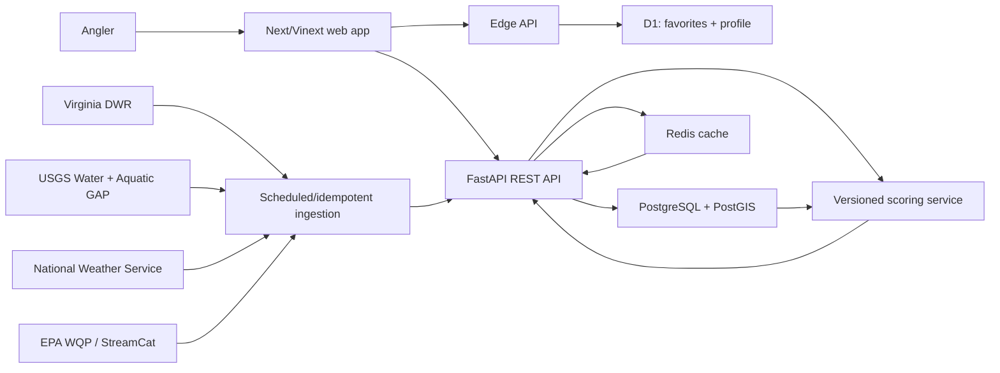
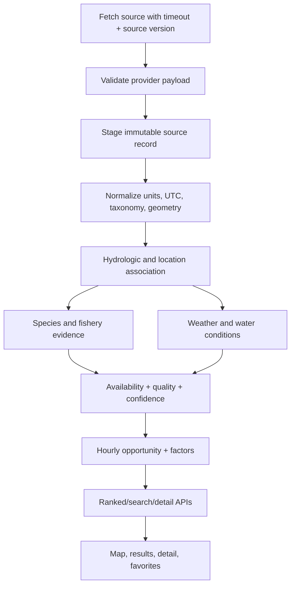
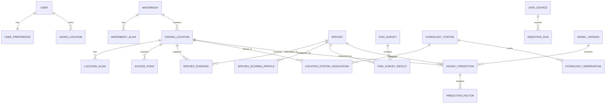

# BiteMap NOVA — Phase 1 implementation plan

Status: approved implementation baseline  
Plan date: 2026-07-13  
Display timezone: `America/New_York`; stored timestamps: UTC

This document is intentionally written before product code. It defines the first
coherent, testable release and the rules that keep its recommendations honest.
The score is an opportunity index, never a catch probability or guarantee.

## 1. Repository structure

```text
.
├── app/                         # Next/Vinext public product routes
│   ├── api/                     # Edge-compatible read/write endpoints
│   ├── locations/[id]/          # Location intelligence page
│   ├── methodology/             # Public score and uncertainty explanation
│   ├── my-spots/                # Identity-aware favorite dashboard
│   ├── data-health/             # Provider and evidence health
│   └── components/              # Search, map, cards, score explanations
├── apps/api/                    # FastAPI reference/API service
│   ├── app/
│   │   ├── api/                 # Versioned REST routers
│   │   ├── core/                # Configuration and security
│   │   ├── data/                # Verified seed snapshot
│   │   ├── ingestion/           # Idempotent import orchestration
│   │   ├── ml/                  # Presence-model experiment boundary
│   │   ├── models/              # SQLAlchemy entities
│   │   ├── providers/           # NWS, USGS, Virginia DWR adapters
│   │   ├── schemas/             # Pydantic API contracts
│   │   └── scoring/             # Pure, versioned scoring functions
│   ├── alembic/                 # PostgreSQL/PostGIS migrations
│   └── tests/                   # Unit and API integration tests
├── db/                          # Drizzle schema for hosted D1 favorites
├── drizzle/                     # Generated hosted-site migrations
├── docs/                        # Architecture, sources, model card, API notes
├── public/                      # Product and social assets
├── tests/                       # Rendered product contract tests
├── worker/                      # Cloudflare worker entry
├── docker-compose.yml           # API, web, PostGIS, Redis
└── .env.example                 # Non-secret configuration contract
```

The deployable web experience uses the bundled Vinext/Cloudflare surface. The
FastAPI service remains a first-class, independently runnable backend matching
the requested long-term architecture. Public browsing does not require an
account. Hosted favorites use D1 and authenticated workspace identity; the
FastAPI target uses PostgreSQL/PostGIS and token/session authentication.

## 2. System architecture



## 3. Data flow



Every normalized record retains `data_source_id`, source record identifier,
retrieval time, source version, original sampling method, and license or use
notes. A provider failure never creates replacement observations; consumers see
stale/unavailable states and a lower confidence score.

## 4. Database entity-relationship design



PostGIS geometries use SRID 4326 at the API boundary and appropriate projected
coordinate systems for distance calculations. Broad rivers are waterbodies;
access points and hydrologically meaningful reaches are separate forecast
locations.

## 5. External providers and exact ingestion strategy

| Provider | Phase 1 use | Ingestion strategy | Refresh | Failure behavior |
|---|---|---|---|---|
| Virginia DWR Boating Access ArcGIS | Verified public access locations | Query FeatureServer as GeoJSON/JSON, upsert on source object id, preserve source coordinates and update timestamps | Weekly + manual | Keep prior snapshot, mark stale |
| Virginia DWR Stocked Trout ArcGIS + stocking plan | Stocked-water geometry and classifications | Query line layer; spatially intersect public access only; curate regulations from dated official plan | Daily in season; monthly otherwise | Never infer public access from trout geometry |
| Virginia DWR reports/pages | Species listings and fishery quality | Curated source-attributed records with publication year, sampling method, extraction date | Annual/manual | Quality becomes unavailable when unsupported |
| USGS Water Services / Water Data APIs | Discharge, gage height, water temperature, turbidity | Pull only manually verified station associations; normalize parameter codes/units; retain qualifiers | 15 minutes recent; daily history | Mark live hydro unavailable; do not substitute nearest gage |
| NWS API | Hourly forecast, observations, alerts | `/points` discovery, cache grid/office endpoints, fetch hourly periods and active alerts with required user agent | 30–60 minutes | Serve last forecast with age or unavailable |
| USGS Aquatic GAP release | Reach-scale modeled distribution support | Versioned bulk download; filter VA and neighboring HUCs; map scientific names; load reach probabilities as *modeled evidence*, not observations | Per release | Keep previous release and version label |
| USGS occurrence/survey inputs | Direct presence/absence | Import source rows with taxon, method, date, coordinates, NHDPlus id, precision | Per release | Reject rows lacking provenance |
| EPA Water Quality Portal | Temperature, DO, turbidity, pH | Provider-specific characteristic mapping; preserve method and detection/quality flags | Weekly/monthly | Exclude incomparable or rejected measurements |
| EPA StreamCat/LakeCat | Static watershed/habitat features | Versioned bulk import joined by COMID/catchment or lake id | Per release | Habitat inference unavailable |
| NOAA historical weather | Historical reconstruction | Batch station/product imports with station-distance and coverage checks | Monthly/backfill | Do not fill missing hours silently |
| NHDPlus | Reach ids, routing, catchments | Version-pinned geometry import; explicit crosswalks between versions | Per release | Disable connected-reach inference on mismatch |

Provider adapters share retry with exponential backoff, bounded timeouts,
rate-limit handling, response schema validation, cache keys including provider
version, idempotent upserts, and ingestion-run audit records.

## 6. Initial verified Northern Virginia locations

The first snapshot is anchored in the Virginia DWR public boating-access layer.
This avoids invented access points and yields 16 official records, satisfying
the requested 15–30 location range.

| Seed | Waterbody | Jurisdiction | DWR coordinate |
|---|---|---|---|
| Lake Burke | Lake Burke | Fairfax | 38.756407, -77.301343 |
| Lake Brittle | Lake Brittle | Fauquier | 38.747826, -77.691239 |
| Lake Frederick | Wheatlands Lake | Frederick | 39.043012, -78.156883 |
| McKimmey (Point of Rocks) | Potomac River | Loudoun | 39.272516, -77.546888 |
| Lake Curtis | Lake Curtis | Stafford | 38.436285, -77.561260 |
| Rocky Pen Park | Rocky Pen Run Reservoir | Stafford | 38.334227, -77.543775 |
| Berry’s | South Fork Shenandoah | Clarke | 39.041631, -77.999671 |
| Castleman’s Ferry | Shenandoah River | Clarke | 39.123933, -77.891047 |
| Lockes | Shenandoah River | Clarke | 39.101569, -77.964838 |
| Bentonville | South Fork Shenandoah | Warren | 38.840096, -78.330420 |
| Catletts Ford Landing | North Fork Shenandoah | Warren | 38.978482, -78.258715 |
| Front Royal | South Fork Shenandoah | Warren | 38.913697, -78.209740 |
| Karo | South Fork Shenandoah | Warren | 38.871521, -78.252644 |
| Morgan’s Ford | Main Stem Shenandoah | Warren | 38.957833, -78.121708 |
| Riverton | North Fork Shenandoah | Warren | 38.949632, -78.198084 |
| Simpson’s | South Fork Shenandoah | Warren | 38.878751, -78.261977 |

Source: Virginia DWR `Public/BoatingAccessSites/FeatureServer/0`, queried
2026-07-13. Species evidence is attached only where a separate official DWR
source supports it. A location may therefore exist with no species score.

## 7. Initial species

`largemouth-bass`, `smallmouth-bass`, `spotted-bass`, `bluegill`,
`redbreast-sunfish`, `black-crappie`, `white-crappie`, `channel-catfish`,
`blue-catfish`, `flathead-catfish`, `rainbow-trout`, `brown-trout`,
`brook-trout`, `common-carp`, `northern-snakehead`, `walleye`, `yellow-perch`,
`white-perch`, `striped-bass`, and `muskellunge`.

Not every species is scored at every location. The UI only ranks a location for
a species when evidence produces availability above the configured threshold.

## 8. Species scoring profile format

```json
{
  "species_code": "smallmouth-bass",
  "version": "1.0.0",
  "temperature_c": { "optimal": [17, 23], "tolerable": [10, 29] },
  "flow_ratio": { "optimal": [0.8, 1.2], "tolerable": [0.45, 1.8] },
  "turbidity_ntu": { "optimal": [2, 20], "tolerable": [0, 60] },
  "hour_weights": {
    "water_temperature": 0.28,
    "flow": 0.21,
    "light": 0.18,
    "wind": 0.09,
    "cloud": 0.09,
    "precipitation": 0.08,
    "season": 0.07
  },
  "techniques": {
    "cool_stable_river": ["ned-rig", "tube", "small-paddletail"]
  },
  "minimum_availability": 0.35
}
```

Profiles live in versioned configuration/database records; no species constants
are scattered through route or presentation code.

## 9. Detailed availability formula

Each evidence row receives:

`w = authority × directness × method_quality × geographic_precision × recency`

All factors are in `[0, 1]`. Recency uses an evidence-type half-life (for
example, survey 8 years, stocking 1 year, official stable species list 12
years). Presence weights are positive; explicit absence weights are negative
only when sampling effort and method could reasonably detect the species.

```text
P = sum(max(w, 0))
N = sum(abs(min(w, 0)))
availability = P / (P + N + 0.75)
```

Rules:

- No evidence returns `0`, not a regional default.
- A direct incompatible-waterbody rule caps availability at `0.05`.
- A verified barrier prevents connected-reach evidence from crossing it.
- Modeled habitat evidence contributes at most `0.25` total without a direct or
  official listing.
- Weather and current conditions never enter this component.
- Evidence conflicts are returned to the user and reduce confidence.

## 10. Detailed long-term fishery-quality formula

Each quality metric is normalized to `[0, 1]` only against the same species,
region, sampling method, and comparable waterbody class.

```text
metric_weight = method_reliability × recency × sample_coverage
quality = sum(metric_value × metric_weight) / sum(metric_weight)
```

DWR qualitative ratings map through a versioned table (`poor=.20`, `fair=.40`,
`good=.65`, `very_good=.80`, `excellent=.90`) and always retain the original
label. CPUE is never described as angler catch rate. With no comparable metric,
quality is `null`; final scoring uses a neutral `0.5` placeholder and applies a
confidence penalty while explaining the missing evidence.

## 11. Detailed hourly activity formula

Every environmental input is converted to a species-profile suitability in
`[0, 1]` with piecewise-linear curves between tolerable and optimal bands.

```text
activity = sum(suitability_i × configured_weight_i) /
           sum(configured_weight_i for available inputs)
```

At least 45% of configured weight must be observed or forecast for an activity
score. Water-temperature estimates are marked `estimated`, never observed. A
heavy-rain or rapidly rising-flow safety gate caps river activity at `0.45` and
the overall opportunity at `35/100` when wading is selected.

## 12. Final opportunity formula

Let `A` be availability, `Q` quality, `H` hourly activity, and `X` access fit.

```text
opportunity = round(100 × A^1.5 × (0.35Q + 0.50H + 0.15X))
```

Missing `Q` or `H` uses `0.5` only for continuity and is made explicit in the
explanation and confidence. Availability’s exponent is the species gate: good
weather cannot elevate a location with weak presence evidence. Safety caps are
applied after the formula. Scores are relative opportunity indices.

## 13. Detailed confidence formula

```text
base = 0.30×coverage + 0.25×recency + 0.20×authority +
       0.15×agreement + 0.10×directness
confidence = 100 × base × horizon_factor × association_factor
```

`horizon_factor` declines from `1.0` today to `0.72` at day 5.
`association_factor` is `1.0` for a manually verified same-waterbody gage,
`0.85` for a verified connected reach, `0.65` for unverified association, and
`0.55` when hydrology is relevant but unavailable. Estimated water temperature
reduces recency/directness but does not alter the score silently.

Labels: `High ≥ 75`, `Moderate 50–74`, `Low < 50`. Confidence is never folded
into the opportunity number; both are displayed separately.

## 14. Search architecture

One index contains species, waterbodies, defined forecast locations, access
points, parks, aliases, counties, towns, and ZIP codes with type and parent
identifiers. Normalization lowercases, removes punctuation/diacritics, and
expands curated abbreviations. Ranking order is exact official name, exact
alias, prefix, token containment, then conservative trigram similarity.
Approximate matches require similarity `≥ .42`, share a token or prefix, and
never cross entity types without a visible label. Broad waterbody hits expand
to public access/forecast locations. PostGIS supports radius/bounding-box
filtering; map-area search passes the viewport bounds explicitly.

## 15. Favorites architecture

Public data is readable anonymously. Favorite writes require server-verified
identity. Hosted Sites uses email/password accounts and hashed sessions in D1;
the FastAPI target uses the equivalent user/session boundary and PostgreSQL.
The browser never supplies a trusted owner id. A server-side account adapter
preserves one frontend contract across both deployments; Docker exchanges the
FastAPI bearer token for an HTTP-only, same-site web cookie. `SavedLocation`
supports nickname, notes,
preferred species, default access method, sort order, and group. Dashboard
cards join saved locations to the latest prediction snapshot. Delete is scoped
to both favorite id and authenticated user id.

## 16. ML experiment design

The first experiment predicts species presence/habitat suitability, not hourly
catch success. Labels come from method-preserved presence/valid absence rows.
Features use NHDPlus reach/catchment, StreamCat/LakeCat, climate summaries,
connectivity, waterbody type, and separately encoded stocking history.

- Baseline: regularized logistic regression.
- Challenger: histogram gradient boosting.
- Validation: watershed-grouped folds, spatial holdout, and time-aware holdout
  when sampling dates permit.
- Leakage control: neighboring reaches from the same connected network do not
  straddle train/test; source duplicates are grouped; post-sampling features
  are excluded.
- Metrics: ROC-AUC, precision, recall, F1, Brier score, calibration curve,
  Virginia-only results, held-out-watershed results, and data-poor subsets.
- Deployment gate: adequate sample size, calibrated probabilities, documented
  spatial transfer limits, and performance exceeding transparent evidence
  weighting. Otherwise, the evidence formula remains authoritative.

## 17. Testing strategy

Pure scoring tests cover evidence recency, conflicting presence/absence,
weather-not-overriding-availability, missing quality/activity, safety caps,
staleness, and confidence separation. Provider tests use recorded fixtures and
assert timeouts, retries, units, qualifiers, and provenance. Search tests cover
aliases, conservative fuzzy matching, broad-waterbody expansion, and geographic
filters. API tests cover validation, pagination, filters, favorites ownership,
authentication, and error states. UI contracts cover species search, location
selection, access filters, hourly windows, factor explanations, favorite state,
methodology, and stale/low-confidence notices. Time tests cover UTC storage,
New York display, sunrise/sunset, DST transitions, and day boundaries. PostGIS
queries and spatial ML holdouts run in integration CI with the Compose stack.

## 18. Phase 1 implementation checklist

- [x] Replace starter with responsive map-first product.
- [x] Add 50 verified access seeds plus 13 official stocked-trout waters and source metadata.
- [x] Add configured species catalog and evidence-gated rankings.
- [x] Add unified search, species, water/access, date, and travel controls.
- [x] Add interactive map markers synchronized with ranked results.
- [x] Add location detail, live hourly and five-day outlooks, factors, and safety caps.
- [x] Add public methodology and administrator-only data-health routes.
- [x] Add identity-aware favorites and D1 migration.
- [x] Add FastAPI endpoints, SQLAlchemy/PostGIS models, and Alembic baseline.
- [x] Add NWS, verified USGS Water associations, DWR trout, and Aquatic GAP boundaries.
- [x] Add availability, quality, activity, final score, and confidence functions.
- [ ] Finish canonical scheduled ingestion, persistence, audit history, and retry operations.
- [x] Add unit/API/rendered contract tests.
- [x] Add Docker Compose, `.env.example`, PowerShell-first setup, API/source/license docs.
- [x] Validate the production build and critical user workflows.
- [x] Publish the validated web experience.

## 19. Explicitly deferred

Social feeds, comments, public catch reports, photos, messaging, subscriptions,
notifications, nationwide coverage, catch-probability ML, leaderboards, and
marketplace features remain outside Phase 1. The core release does not depend
on user catch reports.
